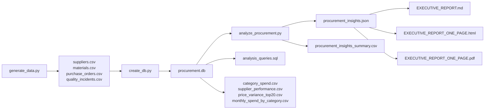

# Procurement Spend Analysis and Supplier Optimization

Production-style analytics case study showing how procurement data can be transformed into quantified savings actions.


## Executive Highlights

- Total analyzed spend: NGN 310.39B
- Total savings opportunity identified: NGN 185.92B (59.90% of spend)
- Price standardization opportunity: NGN 18.45B
- Supplier performance opportunity: NGN 167.47B
- Maverick spend exposure: NGN 40.61B (13.08% of spend)
- USD exposure: USD 132.41M with 99.84% FX volatility range in period

## Why This Project Matters

Procurement teams often have strong transactional records but weak decision intelligence. This project demonstrates an end-to-end approach to:

1. Generate realistic procurement transactions for FMCG operations.
2. Build a query-optimized analytical data store.
3. Quantify spend leakage and supplier risk.
4. Convert findings into executive-ready outputs.

## Repository Contents

Core scripts:

- generate_data.py: synthetic data generation (suppliers, materials, purchase orders, quality incidents)
- create_db.py: CSV-to-SQLite load, indexing, and analytics view creation
- analyze_procurement.py: KPI and savings opportunity computation, JSON export
- analysis_queries.sql: reusable SQL for executive and analyst workflows

Core data and outputs:

- suppliers.csv
- materials.csv
- purchase_orders.csv
- quality_incidents.csv
- procurement.db
- procurement_insights.json
- procurement_insights_summary.csv
- EXECUTIVE_REPORT.md
- EXECUTIVE_REPORT_ONE_PAGE.html
- EXECUTIVE_REPORT_ONE_PAGE.pdf
- category_spend.csv
- supplier_performance.csv
- price_variance_top20.csv
- monthly_spend_by_category.csv

## Architecture



## Analytical Scope

The project addresses five decision domains:

- Spend visibility and category concentration
- Supplier delivery and quality performance
- Price variance and overpayment detection
- Maverick buying and compliance risk
- FX exposure for foreign-currency procurement

## Methodology

### 1) Data generation

- 2,500 purchase orders across 24 months
- 40 suppliers across four procurement categories
- 71 materials/services records
- Realistic delivery delays, quality incidents, currency variation, and payment status patterns

### 2) Data modeling

- SQLite analytical store with four base tables
- Indexed columns for time, supplier, and category access paths
- Reusable analytical views:
    - vw_supplier_performance
    - vw_category_spend
    - vw_savings_opportunities

### 3) Analytics logic

- Price variance opportunity estimated from observed price spread by material
- Supplier performance opportunity estimated from quality impact plus delivery penalty assumptions
- Consolidation opportunity based on supplier fragmentation threshold logic
- Risk slices for maverick spend and FX volatility

### 4) Reporting

- Machine-readable insight export (JSON and CSV)
- Human-readable executive report (Markdown, HTML, PDF)
- Chart-ready tables for BI tools

## Results Snapshot

| Metric | Value |
|---|---:|
| Total Spend | NGN 310,390,475,723 |
| Price Standardization Savings | NGN 18,454,667,942 |
| Supplier Performance Savings | NGN 167,468,695,401 |
| Supplier Consolidation Savings | NGN 0 |
| Total Savings Potential | NGN 185,923,363,343 |
| Savings as % of Spend | 59.90% |
| Maverick Spend | NGN 40,606,789,538 |
| USD Spend | USD 132,407,703 |
| FX Volatility | 99.84% |

## Quick Start

### Prerequisites

- Python 3.10+
- pip

### 1) Clone

```bash
git clone https://github.com/DavidMaco/Procurement_Spend_Analysis.git
cd Procurement_Spend_Analysis
```

### 2) Install dependencies

```bash
python -m pip install --upgrade pip
python -m pip install pandas numpy reportlab
```

### 3) Run the full pipeline

```bash
python generate_data.py
python create_db.py
python analyze_procurement.py
```

### 4) Review outputs

- procurement_insights.json
- procurement_insights_summary.csv
- EXECUTIVE_REPORT_ONE_PAGE.pdf

## Data Dictionary (Condensed)

### suppliers.csv

- supplier_id, supplier_name, category, country, payment_terms, currency, quality_rating, is_approved, risk_level

### materials.csv

- material_id, material_name, category, unit_of_measure, standard_price_ngn, lead_time_days

### purchase_orders.csv

- po_number, po_date, supplier_id, material_id, quantity, unit_price_ngn, total_amount_ngn, total_amount_usd, currency, expected_delivery_date, actual_delivery_date, delivery_status, payment_status, buyer, plant_location

### quality_incidents.csv

- incident_id, po_number, supplier_id, incident_type, severity, cost_impact_ngn

## Reproducibility and Quality Controls

- Fixed random seeds in data generation for repeatable outputs.
- Integrity checks performed on primary keys and cross-table references.
- Scripted pipeline produces deterministic file artifacts for portfolio demonstration.

## Limitations and Assumptions

- Dataset is synthetic and intended for demonstration, not direct operational decisions.
- Savings figures are scenario-based estimates and rely on modeled assumptions.
- Supplier consolidation signal is threshold-dependent and can be tuned for alternate policies.
- No direct ERP integration in this repository version.

## Suggested BI Build (Power BI/Tableau)

Recommended pages:

1. Executive summary (KPI cards, category spend, monthly trend)
2. Supplier performance (OTD vs quality cost, scorecard table)
3. Savings opportunities (price variance and action list)
4. Risk dashboard (maverick spend and FX exposure)

Use these prepared files:

- category_spend.csv
- supplier_performance.csv
- price_variance_top20.csv
- monthly_spend_by_category.csv
- procurement_insights_summary.csv

## Dashboard Screenshots

Screenshot placeholders are organized for recruiter-ready presentation:

- docs/screenshots/01-executive-dashboard.png
- docs/screenshots/02-supplier-performance.png
- docs/screenshots/03-savings-opportunities.png
- docs/screenshots/04-risk-analysis.png

Guidance and naming conventions are documented in docs/screenshots/README.md.

## Skills Demonstrated

- Procurement analytics and strategic sourcing logic
- SQL analytics and schema-aware modeling
- Python data engineering and reporting automation
- Executive storytelling for cost optimization

## Roadmap

- Add dashboard screenshots and PBIX/TWB artifact
- Parameterize scenario assumptions via config file
- Add lightweight test suite for data integrity and metric regression
- Add CI workflow for pipeline validation

## License

For portfolio and educational use. Data is synthetically generated and does not represent any real organization.

## Contact

- GitHub: https://github.com/DavidMaco

If this project is useful, a star is appreciated.
